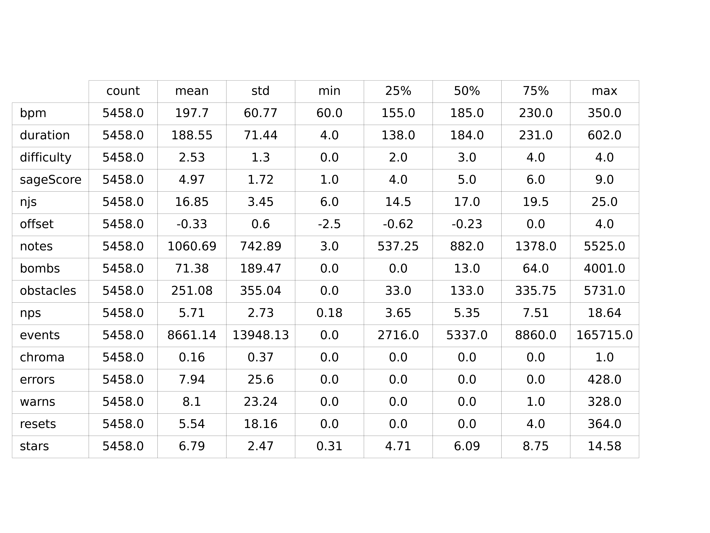
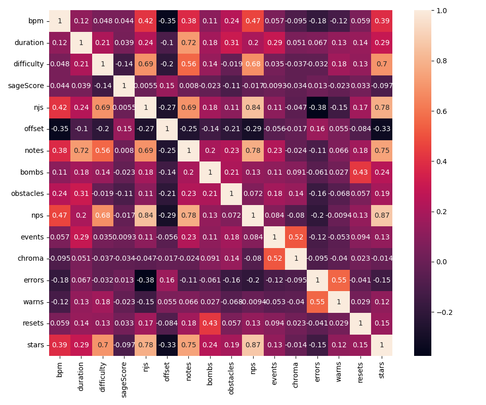
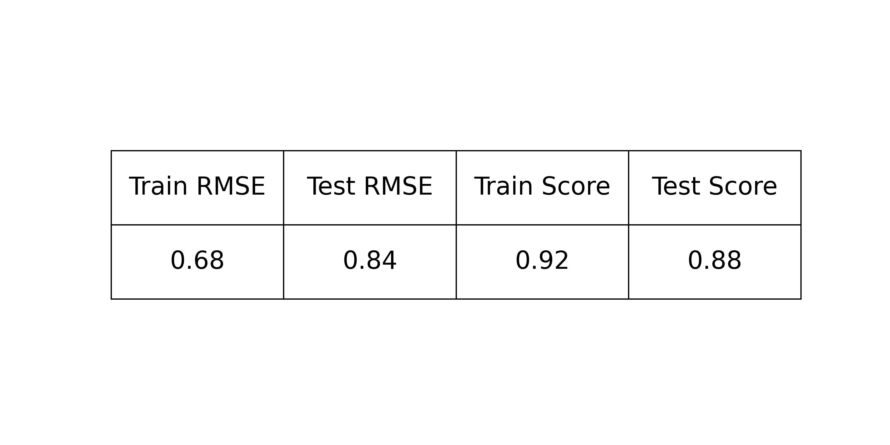

# PredictStarNumberHelper
This creates a learned model for [PredictStarNumber](https://github.com/rakkyo150/PredictStarNumber)

## Relevant Link

Training Data : https://github.com/rakkyo150/RankedMapData  
Model : https://github.com/rakkyo150/PredictStarNumberHelper  
Mod : https://github.com/rakkyo150/PredictStarNumberMod  
Chrome Extension : https://github.com/rakkyo150/PredictStarNumberExtension  

## Describe

## Correlation Matrix

## Model Evaluation

